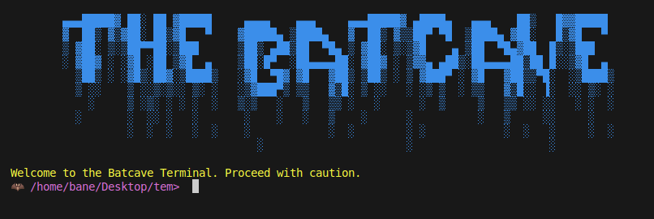

# The Batcave Terminal: Gotham's Command Center

<p align="center">
    
</p>

Holy command line, Batman! Welcome to the Batcave Terminal, a command-line interface that would make even Alfred proud. This Rust-based terminal emulator provides a unique, Batman-themed experience while offering essential file system navigation and manipulation capabilities. It's so secure, even the Riddler couldn't hack it!

## Features

- 🦇 Bat-signal inspired ASCII art banner (may or may not summon Batman)
- 🖤 Dark Knight theme with Bat-yellow output (Bruce Wayne approved)
- 📁 File system operations smoother than the Batmobile's handling
- 📝 Command logging for when you need to review your crime-fighting strategies
- 🔍 Error handling more reliable than Batman's utility belt

## Installation

To install and activate the Batcave Terminal on your Bat-computer, follow these steps:

You can install it from `cargo` by running:

```sh
cargo install batcave
```

Or clone the repository faster than Batman can say "To the Batmobile!":

```sh
git clone https://github.com/ThembinkosiThemba/batcave.git
cd batcave
cargo build --release
cargo run --release
```

## Usage

Once you've launched the Batcave Terminal, you'll be greeted with a bat-tastic ASCII art and a prompt that would make Commissioner Gordon jealous. Here are the available commands to fight crime (or just manage your files):

- `cd [directory]`: Swoop into a new directory
- `pwd`: Reveal your current Bat-location
- `ls [directory]`: Shine the Bat-light on directory contents
- `mkdir [directory_name]`: Construct a new Bat-cave (directory)
- `rm [file_or_directory]`: Dispatch a file or directory to Arkham Asylum
- `touch [file_name]`: Leave your Bat-mark on a new file
- `echo [message]`: Broadcast a message to all of Gotham (or just your terminal)
- `exit`: Hang up the cape and cowl (exit the Batcave Terminal)

Any other commands will be passed to the system shell for execution, but we can't guarantee they'll be as cool as the Bat-commands.

## Customization

Feel free to modify the ASCII art, colors, or add new commands to make the Batcave Terminal your own. The main logic is contained in `src/main.rs`. Remember, Batman works alone, but he's not opposed to a little help from his friends.

## Contributing

Contributions to the Batcave Terminal are welcome! Whether you're a billionaire playboy or just a coding enthusiast, your pull requests, bug reports, and feature suggestions are always appreciated. Just remember: no Kryptonite-based code, please.

## License

This project is licensed under the "Wayne Enterprises Open Source Initiative" License - see the LICENSE file for details. (It's actually just the MIT License, but we think our name sounds cooler.)

## Acknowledgments

- Inspired by the Caped Crusader himself
- Built with Rust, forged in the shadows of Gotham
- Tested on systems from the Batcave to the Justice League Watchtower

Remember, it's not who you are underneath, it's what you type on the command line that defines you. Use the Batcave Terminal wisely, and may it serve you well in your coding adventures!

*"Why do we fall? So we can learn to pick ourselves up."* - Alfred Pennyworth (and also applicable to debugging)